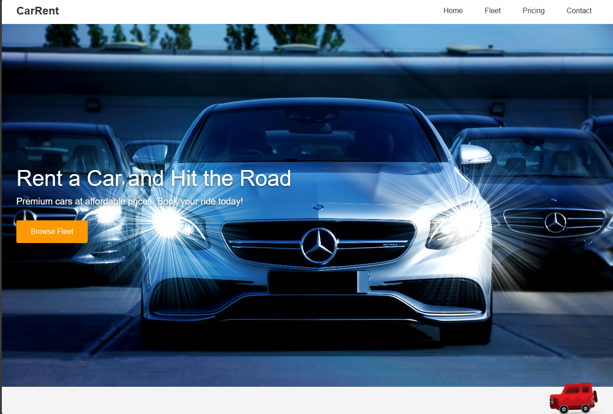
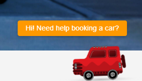
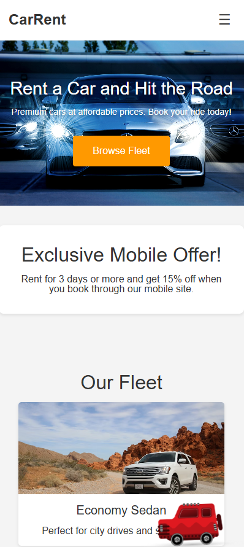
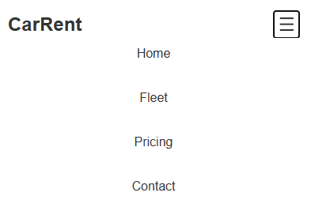
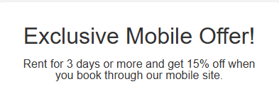

# CarRent Landing Page with animated mascot and responsiveness

A simple and elegant landing page showcasing an affordable car rental service. This page features a hero section, a fleet overview, pricing plans, and a contact form. It’s designed to be responsive, user-friendly, and visually appealing.

---

## Table of Contents

1. [Overview](#overview)
2. [Screenshots](#screenshots)
3. [Live Demo](#live-demo)
4. [Features](#features)
5. [Technologies Used](#technologies-used)
6. [Getting Started](#getting-started)

---

## Overview

**CarRent** provides a clean and modern interface for users looking to rent a car. It includes:
- A hero section to quickly grab the user’s attention.
- A fleet section displaying available car types with images and short descriptions.
- A pricing section with clear, straightforward packages.
- A contact form section where users can send inquiries.
- Responsiveness 
- Animated Mascot
- Mobile-only section (nav bar and special offer)

---

## Screenshots

### 1. Desktop layout



### 2. Mascot



### 3. Mobile  layout



### 4. Navigation menu for mobile devices



### 5. Exclusive offer for mobile devices 


---

## Live Demo

Check out the **CarRent Landing Page** live here:  

[**Live Demo Link**](https://zekor1.github.io/tum-web-lab2/)  

[**Video Demo Link**](https://utm-my.sharepoint.com/:v:/g/personal/maxim_comarov_isa_utm_md/Ee3dGjKjwO9Nq5RCogyaJ30BZaz8UecngY8PCd7KISEzpQ?nav=eyJyZWZlcnJhbEluZm8iOnsicmVmZXJyYWxBcHAiOiJPbmVEcml2ZUZvckJ1c2luZXNzIiwicmVmZXJyYWxBcHBQbGF0Zm9ybSI6IldlYiIsInJlZmVycmFsTW9kZSI6InZpZXciLCJyZWZlcnJhbFZpZXciOiJNeUZpbGVzTGlua0NvcHkifX0&e=bmX9vn)

---

## Features

1. **Sticky Navigation**: The header remains visible as you scroll.
2. **Responsive Design**: Fleet and pricing sections adapt to various screen sizes.
3. **Contact Form**: Enables users to quickly get in touch.
4. **Modern UI**: Clean typography, subtle animations, and consistent styling.
5. **Compatibility with mobile devices**: Web site is adjusted for mobile devices as well as desktop.
6. **Animated Mascot**: Mascot has animations and intention to help. 
7. **Mobile only elements**: There are some elements specific only for mobile devices such as Mobile nav menu (that could be opened), mobile only special offer.
---
## BREAKDOWN OF MASCOT ANIMATION

After refreshing the page, the mascot (a red car) moves onto the screen and comes to a stop in the corner with a bouncing effect. It then floats in the air, it's pausing on cursor focus and resuming its floating motion when the focus is lost.

---

## Technologies Used

- **HTML5** for markup
- **CSS3** for styling (with Grid & Flexbox layouts)
- **[Pexels](https://www.pexels.com/) / [Unsplash](https://unsplash.com/)** for free, high-quality images (credits to photographers)

---

## Getting Started

1. **Clone the Repository**
   ```bash
   git clone https://github.com/zEkoR1/tum-web-lab2
   cd carrent-landing-page
